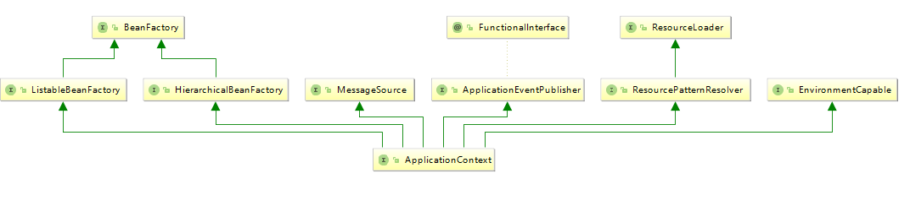

## 编程式使用Ioc容器
下面的代码就是一个简单的直接使用Ioc容器的示例：
```java
public static void main(String[] args) {
    ClassPathResource resource = new ClassPathResource("mySpringConfig");
    DefaultListableBeanFactory factory = new DefaultListableBeanFactory();
    XmlBeanDefinitionReader reader = new XmlBeanDefinitionReader(factory);
    reader.loadBeanDefinitions(resource);
    Book book = (Book) factory.getBean("book");
    System.out.println(book);
}
```
像上面这段代码，我们可以使用factory对象来使用DdefaultListableBeanFactory这个容器了。在使用IOC容器时。需要如下几个步骤：
1. 创建Ioc容器的抽象资源文件，这个抽象资源文件包含了BeanDefinition的定义。
2. 创建一个BeanFactory，这里使用的是DefaultListableBeanFactory。
3. 创建一个载入BeanDefinitions的读取器，这里使用的是XmlBeanDefinitionReader来载入XML文件形式的BeanDefinitions，然后通过一个回调配置给BeanFactory。

然后从资源定义好的位置读入配置信息，具体的解析过程让XmlBeanDefinitionReader来完成。
## ApplicationContext
ApplicationContext是高级形态意义的Ioc容器，下图是ApplicationContext的继承图:

相比于普通的BeanFactory，ApplicationContext新增如下的功能
+ 只是不同的信息源。ApllicationContext扩展了MessageSource接口。
+ 访问资源。这个特性体现在对ResourceLLoader和Resource的支持上,这样我们可以从不同的地方获取到Bean定义资源。
+ 支持应用事件。继承接口ApllicationEventPublisher，从而在上下文中引入事件机制。这些事件机制和Bean的使命周期结合为Bean的管理提供了便利。
...
## ApplicationContext的设计原理
这里我们使用ApplicationContext的实现类FileSystemXmlApplicationContext的实现来说明ApplicationContext的实现来说明ApplicationContext容器的设计原理。
```
public class FileSystemXmlApplicationContext extends AbstractXmlApplicationContext {

	
	public FileSystemXmlApplicationContext() {
	}

	public FileSystemXmlApplicationContext(ApplicationContext parent) {
		super(parent);
	}

	public FileSystemXmlApplicationContext(String configLocation) throws BeansException {
		this(new String[] {configLocation}, true, null);
	}

	public FileSystemXmlApplicationContext(String... configLocations) throws BeansException {
		this(configLocations, true, null);
	}

	public FileSystemXmlApplicationContext(String[] configLocations, ApplicationContext parent) throws BeansException {
		this(configLocations, true, parent);
	}

	public FileSystemXmlApplicationContext(String[] configLocations, boolean refresh) throws BeansException {
		this(configLocations, refresh, null);
	}

	public FileSystemXmlApplicationContext(
			String[] configLocations, boolean refresh, @Nullable ApplicationContext parent)
			throws BeansException {

		super(parent);
		setConfigLocations(configLocations);
		if (refresh) {
			refresh();
		}
	}

	@Override
	protected Resource getResourceByPath(String path) {
		if (path.startsWith("/")) {
			path = path.substring(1);
		}
		return new FileSystemResource(path);
	}

}
```
在FileSystemXmlApplicationContext中，我们已经看出ApplicationContext应用上下文的主要功能已经在FileSystemXmlApplicationContext的基类AbstractXmlApplicationContext中实现了,在FileSystemXmlApplicationContext中主要有两个功能：
1. 如果应用支持FileSystemXmlApplicationContext应用上下文，对于实例化这个应用上下文支持，同时启动Ioc容器的refresh()过程。她所对应的代码如下：
```
public FileSystemXmlApplicationContext(
			String[] configLocations, boolean refresh, @Nullable ApplicationContext parent)
			throws BeansException {

	super(parent);
	setConfigLocations(configLocations);
	if (refresh) {
		refresh();
	}
}
```
这个refresh()会牵扯Ioc容器的一系列复杂的操作，同时对于不同的容器实现这些操作都是类似的，因此在基类中将它们封装好。所以在FileSystemXmlApplicationContext中只是一个简单的调用。
2. 第二个功能是与FileSystemXmlApplicationContext设计相关的功能,这部分与怎样从系统的文件资源中加载XML的Bean定义有关。
```
@Override
protected Resource getResourceByPath(String path) {
	if (path.startsWith("/")) {
		path = path.substring(1);
	}
	return new FileSystemResource(path);
}
```
