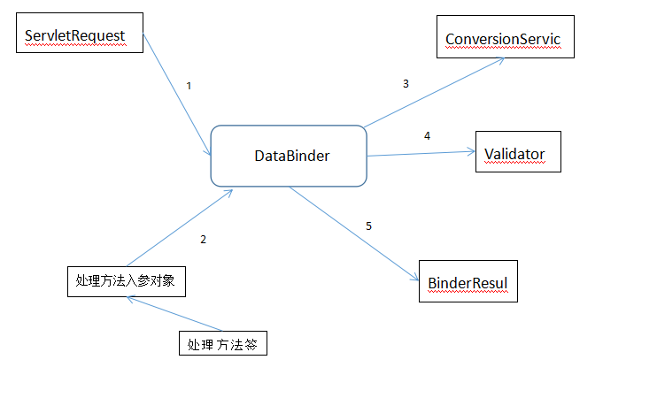

## 1. 数据绑定流程
Spring MVC通过反射机制对目标处理方法进行分析，并将消息绑定到目标方法的参数中。数据绑定的核心部件是DataBinder，其运行机制如下图：

Spring MVC将ServletRequest对象及处理方法的参数对象传递给DataBinder，DataBinder调用装配在Spring MVC上下文中的ConversionService组件进行数据类型转换、数据格式化,并将ServletRequest对象中的参数填充到参数对象中.然后再调用Validator组件对已经绑定了请求消息的数据参数的对象进行数据合法性验证，并最终生成结果BindingResult对象。BindingAResult对象包含已经完成数据绑定的参数对象,还包含相应的校验错误对象，Spring MVC抽取相应的参数对象和错误处理对象，并将调用相应的处理方法。
## 2. 数据转换
在Java语言中的java.beans包中提供了一个PropertyEditor接口来进行数据转换。PropertyEditor的作用是将一个字符串转化成一个Java对象。
PropertyEditor有一个不足之处，那就是不能讲一个Java对象转换成另一个Java对象。另一个不足之处就是对原对象及目标对象的上下文信息（入注解等）不敏感，在类型转换时不能利用这些上下文信息实施高级转换。
所以Spring就提供了一个比较高级的类型转换模块，该模块位于org.springframwork.core.convert包下。虽然这个模块比Java提供的好，但是由于历史原因所以Spring同时支持两者。
### 2.1 ConversionService
下面的是ConversionService的接口的源码：
```java
public interface ConversionService {

	/**
	 * Return {@code true} if objects of {@code sourceType} can be converted to the {@code targetType}.
	 * <p>If this method returns {@code true}, it means {@link #convert(Object, Class)} is capable
	 * of converting an instance of {@code sourceType} to {@code targetType}.
	 * <p>Special note on collections, arrays, and maps types:
	 * For conversion between collection, array, and map types, this method will return {@code true}
	 * even though a convert invocation may still generate a {@link ConversionException} if the
	 * underlying elements are not convertible. Callers are expected to handle this exceptional case
	 * when working with collections and maps.
	 * @param sourceType the source type to convert from (may be {@code null} if source is {@code null})
	 * @param targetType the target type to convert to (required)
	 * @return {@code true} if a conversion can be performed, {@code false} if not
	 * @throws IllegalArgumentException if {@code targetType} is {@code null}
	 */
	boolean canConvert(@Nullable Class<?> sourceType, Class<?> targetType);

	/**
	 * Return {@code true} if objects of {@code sourceType} can be converted to the {@code targetType}.
	 * The TypeDescriptors provide additional context about the source and target locations
	 * where conversion would occur, often object fields or property locations.
	 * <p>If this method returns {@code true}, it means {@link #convert(Object, TypeDescriptor, TypeDescriptor)}
	 * is capable of converting an instance of {@code sourceType} to {@code targetType}.
	 * <p>Special note on collections, arrays, and maps types:
	 * For conversion between collection, array, and map types, this method will return {@code true}
	 * even though a convert invocation may still generate a {@link ConversionException} if the
	 * underlying elements are not convertible. Callers are expected to handle this exceptional case
	 * when working with collections and maps.
	 * @param sourceType context about the source type to convert from
	 * (may be {@code null} if source is {@code null})
	 * @param targetType context about the target type to convert to (required)
	 * @return {@code true} if a conversion can be performed between the source and target types,
	 * {@code false} if not
	 * @throws IllegalArgumentException if {@code targetType} is {@code null}
	 */
	boolean canConvert(@Nullable TypeDescriptor sourceType, TypeDescriptor targetType);

	/**
	 * Convert the given {@code source} to the specified {@code targetType}.
	 * @param source the source object to convert (may be {@code null})
	 * @param targetType the target type to convert to (required)
	 * @return the converted object, an instance of targetType
	 * @throws ConversionException if a conversion exception occurred
	 * @throws IllegalArgumentException if targetType is {@code null}
	 */
	@Nullable
	<T> T convert(@Nullable Object source, Class<T> targetType);

	/**
	 * Convert the given {@code source} to the specified {@code targetType}.
	 * The TypeDescriptors provide additional context about the source and target locations
	 * where conversion will occur, often object fields or property locations.
	 * @param source the source object to convert (may be {@code null})
	 * @param sourceType context about the source type to convert from
	 * (may be {@code null} if source is {@code null})
	 * @param targetType context about the target type to convert to (required)
	 * @return the converted object, an instance of {@link TypeDescriptor#getObjectType() targetType}
	 * @throws ConversionException if a conversion exception occurred
	 * @throws IllegalArgumentException if targetType is {@code null},
	 * or {@code sourceType} is {@code null} but source is not {@code null}
	 */
	@Nullable
	Object convert(@Nullable Object source, @Nullable TypeDescriptor sourceType, TypeDescriptor targetType);

}
```
除了注释也就4个方法：
1. `boolean canConvert(@Nullable Class<?> sourceType, Class<?> targetType);`判断是否可以将一个Java类转换成另外一个类。
2. `boolean canConvert(@Nullable TypeDescriptor sourceType, TypeDescriptor targetType);`需要转换的类将以成员变量的的方式出现，TypeDescriptor不但描述了需要转换类的信息，还描述了类的上下文信息，例如成员变量上的注解是否以数组、集合或者Map的方式呈现等。
3. `<T> T convert(@Nullable Object source, Class<T> targetType);`将源对象转换为目标类型对象。
4. 将对象从源类型对象转换为目标对象，通常会利用到类中的上下文信息。
可以利用org.springframework.context.support.ConversionServiceFactoryBean在Spring的上下文中定义一个Conversion。Spring将自动识别出上下文中的ConversionService，并在Spring MVC处理方法的参数绑定中使用它来进行数据转换。配置如下：
```xml
<bean id="conversionService" class="org.springframework.context.support.ConversionServiceFactoryBean" />
```
在ConversionServiceFactoryBean中内置了很多的类型转换器，可以完成大部分的Java类型转换工作。除了String对象转换成各种基础的类型之外，还包括String、Number、Array、Collection、Map、Properties及Object之间的转换器。
可以通过ConversionServiceFactoryBean的converter属性注册自定义的类型转换器，如下：
```xml
<bean id="conversionService" class="org.springframework.context.support.ConversionServiceFactoryBean" >
    <property name="converters">
        <list>
            <bean class="com.example.converter.StringToDateConverter"
                 p:dataPattern="yyyy-MM-dd"/>
        </list>
    </property>
</bean>
```
### 2.2 Spring支持的转换器
Spring在org.springframwork.core.convert.converter包中定义了3种类型的转换器接口，实现其中的一个接口即可。实现后需要将其注册到ConversionServiceFactoryBean中。
+ Converter<S, T>。Converter<S, T>接口是Spring类型转换中最简单的一个接口，该接口中中只有一个方法：
`T convert(S var1);`
+ ConveterFactory<S, R>。如果希望将一种类型的对象转换为另一种类型及其子类对象，比如将String转换为Number以及Number的子类Integer、Double等对象，就需要一系列的Converter，如StringToInteger、StringToDouble等。ConverterFactory<S, R>接口的作用就是将相同系列的多个Converter封装在一起。该接口也只有一个方法：
`<T extends R> Converter<S, T> getConverter(Class<T> targetType);`其中S为转换的源类型，R为目标类型的基类，T为R的子类。
+ GenericConverter。GenericConverter接口会根据源类对象及目标类型对象及目标对象的上下文信息进行类型转换，该接口中定义了两个方法：
```
Set<ConvertiblePair> getConvertibleTypes();
Object convert(Object source, TypeDescriptor sourceType, TypeDescriptor targetType);
```
ConvertiblePair封装了源类型和目标类型，而TypeDescriptor中包含了需要转换的类型对象的上下文信息。
### 2.3 自定义类型转换器
```xml
<!-- 装配一个自定义的类型转换器 -->
<mvc:annotation-driven conversion-service="conversionService" />
<!-- 自定义类型转换器 -->
<bean id="conversionService" class="org.springframework.context.support.ConversionServiceFactoryBean" >
    <property name="converters">
        <list>
            <bean class="com.example.converter.StringToDateConverter"
                p:dataPattern="yyyy-MM-dd"/>
        </list>
    </property>
</bean>
```
### 2.4 Spring中旧的转换
Spring也支持Java的PropertyEditor。可以在控制器中使用@InitBinder添加自定义的编辑器。
1. 创建类型转换器
```
public class DateEditer extends PropertyEditorSupport {
    // 将传入的字符串转化为Date

    @Override
    public void setAsText(String text) throws IllegalArgumentException {
        SimpleDateFormat simpleDateFormat = new SimpleDateFormat("yyyy-MM-dd");
        try {
            Date date = simpleDateFormat.parse(text);
            setValue(date);
        } catch (ParseException pe) {
            pe.printStackTrace();
        }
    }
}
```
2. 在Controller中注册
```java
// 在控制器初始化时注册属性编辑器
@InitBinder
public void initBinder(WebDataBinder binder) {
    // 注册自定义编辑器
    binder.registerCustomEditor(Date.class, new DateEditer());
}
```
### 2.5 在全局范围内使用自定义编辑器
在全局范围内使用自定义编辑器可以通过实现WebBindingInitializer接口并在该类中注册自定义的编辑器。
```
public class DateBindingInitializer implements WebBindingInitializer {
    @Override
    public void initBinder(WebDataBinder binder) {
        // 注册自定义编辑器
        binder.registerCustomEditor(Date.class, new DateEditor());
    }
}
```
在Spring的配置文件中配置全局的自定义编辑器
```
<!-- 通过RequestMappingHandlerAdapter装配自定义编辑器 -->
<bean class="org.springframework.web.servlet.mvc.method.annotation.RequestMappingHandlerAdapter">
    <property name="webBindingInitializer">
        <bean class="com.example.binding.DateBindingInitializer" />
    </property>
</bean>
```

### 2.6 多种转换器的优先顺序
顺序如下：
1. 通过@InitBinder装配的自定义编辑器。
2. 通过ConversionService装配的自定义编辑器。
3. 通过WebBindingInitializer接口装配的全局自定义编辑器。