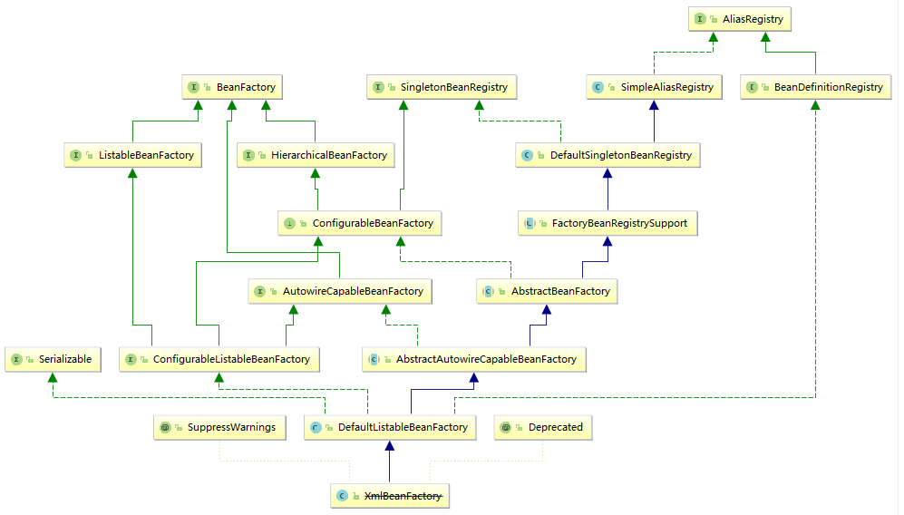
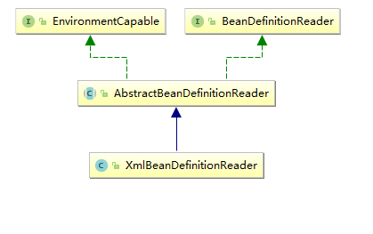

# 从XmlBeanFactory开始分析
虽然XmlBeanFactory是一个过时的方法，但是其实他的代码很简单，XmlBeanFactory没有实现任何的功能，他只是将这些都交给其他的类去实现了。
下面的的就是XmlBeanFactory的源码(去掉注释和import)：
```java
@Deprecated
@SuppressWarnings({"serial", "all"})
public class XmlBeanFactory extends DefaultListableBeanFactory {

	private final XmlBeanDefinitionReader reader = new XmlBeanDefinitionReader(this);


	public XmlBeanFactory(Resource resource) throws BeansException {
		this(resource, null);
	}

	public XmlBeanFactory(Resource resource, BeanFactory parentBeanFactory) throws BeansException {
		super(parentBeanFactory);
		this.reader.loadBeanDefinitions(resource);
	}

}
```
上面的源码中可以看出XmlBeanFactory类只有两个构造器，其它的都交给它的父类DefaultListableBeanFactory实现了。
第一个构造器传了一个Resource，它的作用相当于一个输入流，Resource及其实现类是spring封装的Java中的输入输出流。
```java
public XmlBeanFactory(Resource resource) throws BeansException {
		this(resource, null);
	}
```
第二个构造器是需要的参数是一个BeanFactory类型和一个Resource类型的，BeanFactory类型的变量将会成为新的BeanFactory的父类容器。
```
public XmlBeanFactory(Resource resource, BeanFactory parentBeanFactory) throws BeansException {
		super(parentBeanFactory);
		this.reader.loadBeanDefinitions(resource);
}
```
下面的是XmlBeanFactory的继承体系:

从上面的分析中也可以看出来XmlBeanFactory的工作基本上都被DefaultListableBeanFactory完成了。
XmlBeanFactory中的resource被加载进来后的下一站是XmlBeanDefinitionReader，也就是下面的之一段代码：
```java
@Override
public int loadBeanDefinitions(Resource resource) throws BeanDefinitionStoreException {
	return loadBeanDefinitions(new EncodedResource(resource));
}
```
从上面的这个方法的名字中可以看出，这个方法是用来载入Bean的定义的，然后继续下一站:
```
public int loadBeanDefinitions(EncodedResource encodedResource) throws BeanDefinitionStoreException {
	// 断言EncodedResource是非空的
	Assert.notNull(encodedResource, EncodedResource must not be null");
	// 如果logger能够使用...
	if (logger.isInfoEnabled()) {
		logger.info("Loading XML bean definitions rom " + encodedResource.getResource());
	}
	// 这里使用了一个ThreadLocal这个类，它的作用是在多程的环境中保证变量的安全
	Set<EncodedResource> currentResources = his.resourcesCurrentlyBeingLoaded.get();
	// 如果currentResources是空的，那么就重新创建一个
	if (currentResources == null) {
		currentResources = new HashSet<>(4);
		this.resourcesCurrentlyBeingLoaded.set(currentResources);
	}
	// 然后将新传入的resource添加currentResource，如果加失败那么就抛出异常
	if (!currentResources.add(encodedResource)) {
		throw new BeanDefinitionStoreException(
				"Detected cyclic loading of " + ncodedResource + " - check your mport definitions!");
	}
	try {
		// 得到resource的输入流
		InputStream inputStream = ncodedResource.getResource().getInputStream);
		try {
			// 将其转入为InputSource，InputSource是ax解析XML的一个类
			InputSource inputSource = new nputSource(inputStream);
			if (encodedResource.getEncoding() != ull) {
				// 从encodedResource中获取编码，并设在inputSource中
				inputSource.setEncodingencodedResource.getEncoding());
			}
			// 下来就是加载Bean的定义了
			return doLoadBeanDefinitionsinputSource, ncodedResource.getResource());
		}
		finally {
			inputStream.close();
		}
	}
	catch (IOException ex) {
		throw new BeanDefinitionStoreException(
				"IOException parsing XML document rom " + encodedResource.getResource), ex);
	}
	finally {
		// 回收资源
		currentResources.remove(encodedResource);
		if (currentResources.isEmpty()) {
			this.resourcesCurrentlyBeingLoaded.emove();
		}
	}
}
```
它的是XmlBeanDefitionReader的重载的一个方法，可以看到只是一个Spring专门为了XMLBeanDefinition（Bean的定义）而做的一个类。下面的是它的继承体系图:

在这里为什么要使用sax的解析方式呢？我想是因为sax的解析方式是一行一行解析的，所以速度比较快。而且解析BeanDefinions的XML不需要添加和删除标签，所以是这里适用的。
来继续下一站。
```
protected int doLoadBeanDefinitions(InputSource inputSource, Resource resource)
		throws BeanDefinitionStoreException {
	try {
		Document doc = doLoadDocument(inputSource, esource);
		return registerBeanDefinitions(doc, esource);
	}
	catch (BeanDefinitionStoreException ex) {
		throw ex;
	}
	catch (SAXParseException ex) {
		throw new XmlBeanDefinitionStoreExceptionresource.getDescription(),
				"Line " + ex.getLineNumber() + " in ML document from " + resource + " s invalid", ex);
	}
	catch (SAXException ex) {
		throw new XmlBeanDefinitionStoreExceptionresource.getDescription(),
				"XML document from " + resource + " s invalid", ex);
	}
	catch (ParserConfigurationException ex) {
		throw new BeanDefinitionStoreExceptionresource.getDescription(),
				"Parser configuration exception arsing XML from " + resource, ex);
	}
	catch (IOException ex) {
		throw new BeanDefinitionStoreExceptionresource.getDescription(),
				"IOException parsing XML document rom " + resource, ex);
	}
	catch (Throwable ex) {
		throw new BeanDefinitionStoreExceptionresource.getDescription(),
				"Unexpected exception parsing XML ocument from " + resource, ex);
	}
}
```
这个函数一开始调用了`Document doc = doLoadDocument(inputSource, esource);`
下面我们先来看InputSource，InputSource在Java的API上是这样介绍的:
> public class InputSource extends ObjectXML 实体的单一输入源。 

> 此模块（包括源代码和文档）在公共域中，同时 没有担保。有关更多信息，请参阅http://www.saxproject.org。 
此类允许 SAX 应用程序封装有关单个对象中的输入源的信息，它可包括公共标识符、系统标识符、字节流（可能带有指定的编码）、基本 URI 和/ 或字符流。
>
> 在以下两种情况下应用程序可以将输入源提供给解析器：作为 Parser.parse 方法的参数，或者作为 EntityResolver.resolveEntity 方法的返回值。
>
> SAX 解析器将使用 InputSource 对象来确定如何读取 XML 输入。如果有字符流可用，则解析器将直接读取该流，而忽略该流中找到的任何文本编码声明。如果没有字符流，但却有字节流，则解析器将使用该字节流，从而使用在 InputSource 中指定的编码，或者另外（如果未指定编码）通过使用某种诸如 XML 规范 中的算法算法自动探测字符编码。如果既没有字符流，又没有字节流可用，则解析器将尝试打开到由系统标识符标识的资源的 URI 连接。
> 
> InputSource 对象属于该应用程序：SAX 解析器将不会以任何方式修改它（它可以在必要时修改副本）。但是，作为解析终止清除的一部分，对字节流和字符流的标准处理就是关闭这二者，因此在将此类流传递给解析器后应用程序不应尝试重新使用它们。

该类的方法也很简单:
+ InputStream getByteStream() 
          获取此输入源的字节流。 
+ Reader getCharacterStream() 
          获取此输入源的字符流。 
+ String getEncoding() 
          获取字节流或 URI 的字符编码。 
+ String getPublicId() 
          获取此输入源的公共标识符。 
+ String getSystemId() 
          获取此输入源的系统标识符。 
+ void setByteStream(InputStream byteStream) 
          设置此输入源的字节流。 
+ void setCharacterStream(Reader characterStream) 
          设置此输入源的字符流。 
+ void setEncoding(String encoding) 
          设置字符编码（如果已知）。 
+ void setPublicId(String publicId) 
          设置此输入源的公共标识符。 
+ void setSystemId(String systemId) 
          设置此输入源的系统标识符。 
反正不管怎样，它的作用基本上就是获取一个输入流。
下面我们来具体看一下这个方法的具体代码：
```
protected Document doLoadDocument(InputSource inputSource, Resource resource) throws Exception {
	return this.documentLoader.loadDocument(inputSource, getEntityResolver(), this.errorHandler,
			getValidationModeForResource(resource), isNamespaceAware());
}
```
下面的是getEntityResolver()的源码:
```
protected EntityResolver getEntityResolver() {
	if (this.entityResolver == null) {
		// Determine default EntityResolver to use.
		ResourceLoader resourceLoader = getResourceLoader();
		if (resourceLoader != null) {
			this.entityResolver = new ResourceEntityResolverresourceLoader);
		}
		else {
			this.entityResolver = new DelegatingEntityResolvergetBeanClassLoader());
		}
	}
	return this.entityResolver;
}
```
下面的是EntityResolver的文档解释:
> 用于解析实体的基本接口。 
>
> 此模块（包括源代码和文档）在公共域中，同时 没有担保。有关更多信息，请参阅http://www.saxproject.org。 
如果 SAX 应用程序需要实现自定义处理外部实体，则必须实现此接口并使用 setEntityResolver 方法向 SAX 驱动器注册一个实例。
> 
> 然后 XML 阅读器将允许应用程序在包含外部实体之前截取任何外部实体（包括外部 DTD 子集和外部参数实体，如果有）。
>
> 许多 SAX 应用程序不需要实现此接口，但对于从数据库或其他特定的输入源中构建 XML 文档的应用程序，或者对于使用 URI 类型（而不是 URL ）的应用程序，这特别有用。


其中的这个类有这样的一行代码:`private DocumentLoader documentLoader = new DefaultDocumentLoader();`而这个类又是Spring自己做的一个类。
```
public class DefaultDocumentLoader implements DocumentLoader {

	/**
	 * JAXP attribute used to configure the schema language for validation.
	 */
	private static final String SCHEMA_LANGUAGE_ATTRIBUTE = "http://java.sun.com/xml/jaxp/properties/schemaLanguage";

	/**
	 * JAXP attribute value indicating the XSD schema language.
	 */
	private static final String XSD_SCHEMA_LANGUAGE = "http://www.w3.org/2001/XMLSchema";


	private static final Log logger = LogFactory.getLog(DefaultDocumentLoader.class);


	/**
	 * Load the {@link Document} at the supplied {@link InputSource} using the standard JAXP-configured
	 * XML parser.
	 */
	@Override
	public Document loadDocument(InputSource inputSource, EntityResolver entityResolver,
			ErrorHandler errorHandler, int validationMode, boolean namespaceAware) throws Exception {

		DocumentBuilderFactory factory = createDocumentBuilderFactory(validationMode, namespaceAware);
		if (logger.isDebugEnabled()) {
			logger.debug("Using JAXP provider [" + factory.getClass().getName() + "]");
		}
		DocumentBuilder builder = createDocumentBuilder(factory, entityResolver, errorHandler);
		return builder.parse(inputSource);
	}

	/**
	 * Create the {@link DocumentBuilderFactory} instance.
	 * @param validationMode the type of validation: {@link XmlValidationModeDetector#VALIDATION_DTD DTD}
	 * or {@link XmlValidationModeDetector#VALIDATION_XSD XSD})
	 * @param namespaceAware whether the returned factory is to provide support for XML namespaces
	 * @return the JAXP DocumentBuilderFactory
	 * @throws ParserConfigurationException if we failed to build a proper DocumentBuilderFactory
	 */
	protected DocumentBuilderFactory createDocumentBuilderFactory(int validationMode, boolean namespaceAware)
			throws ParserConfigurationException {

		DocumentBuilderFactory factory = DocumentBuilderFactory.newInstance();
		factory.setNamespaceAware(namespaceAware);

		if (validationMode != XmlValidationModeDetector.VALIDATION_NONE) {
			factory.setValidating(true);
			if (validationMode == XmlValidationModeDetector.VALIDATION_XSD) {
				// Enforce namespace aware for XSD...
				factory.setNamespaceAware(true);
				try {
					factory.setAttribute(SCHEMA_LANGUAGE_ATTRIBUTE, XSD_SCHEMA_LANGUAGE);
				}
				catch (IllegalArgumentException ex) {
					ParserConfigurationException pcex = new ParserConfigurationException(
							"Unable to validate using XSD: Your JAXP provider [" + factory +
							"] does not support XML Schema. Are you running on Java 1.4 with Apache Crimson? " +
							"Upgrade to Apache Xerces (or Java 1.5) for full XSD support.");
					pcex.initCause(ex);
					throw pcex;
				}
			}
		}

		return factory;
	}

	/**
	 * Create a JAXP DocumentBuilder that this bean definition reader
	 * will use for parsing XML documents. Can be overridden in subclasses,
	 * adding further initialization of the builder.
	 * @param factory the JAXP DocumentBuilderFactory that the DocumentBuilder
	 * should be created with
	 * @param entityResolver the SAX EntityResolver to use
	 * @param errorHandler the SAX ErrorHandler to use
	 * @return the JAXP DocumentBuilder
	 * @throws ParserConfigurationException if thrown by JAXP methods
	 */
	protected DocumentBuilder createDocumentBuilder(DocumentBuilderFactory factory,
			@Nullable EntityResolver entityResolver, @Nullable ErrorHandler errorHandler)
			throws ParserConfigurationException {

		DocumentBuilder docBuilder = factory.newDocumentBuilder();
		if (entityResolver != null) {
			docBuilder.setEntityResolver(entityResolver);
		}
		if (errorHandler != null) {
			docBuilder.setErrorHandler(errorHandler);
		}
		return docBuilder;
	}

}

```