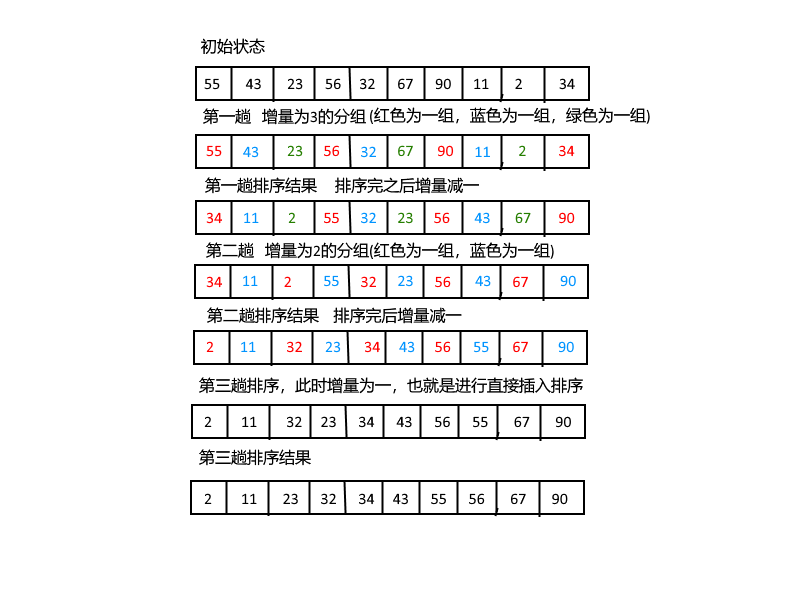

## 希尔排序
希尔排序是直接插入排序的升级，希尔排序的出现冲破了$O(n^2)$时间的屏障， **它的思想是将待排序的序列分割成若干子序列，分割的方式是隔几个元素（相隔“增量”）取一个元素，然后依次进行直接插入排序，然后减小增量，循环进行上述的过程，直到增量为1。当增量为1是也就是对待排序的序列进行直接插入排序，那么排序之后的序列就肯定是有序的了。** 

随着增量的缩小会使整个序列达到基本有序，而直接插入排序在元素基本有序时的效率很高。因为当元素基本有序时，不需要进行大量的数据元素的搬移。比如假设现在有一个数组为{55, 43, 23, 56, 32, 67, 90, 11, 2, 34}，现在第一次的增量为3，第一次把数组分成如下几组{<font color="red">55</font>, <font color="blue">43</font>, <font color="green">23</font>, <font color="red">56</font>, <font color="blue">32</font>, <font color="green">67</font>, <font color="red">90</font>, <font color="blue">11</font>, <font color="green">2</font>, <font color="red">34</font>}, 其中红色的为一组，蓝色的为一组，绿色的为一组，分别对他们进行直接插入排序，这就是希尔排序的一趟；然后增量减一，接着分成两组，继续进行排序，然后再次减一，这时候增量为1，也就是进行直接插入排序，下图就是一个完整的过程：

下面的是代码实现：
```c
void ShellSort(int a[], int n) {
    int i, j, Increment;
    int temp;
    // 这里的增量的初始值元素个数除以3，之后是增量除以3作为下一次的增量
    for (Increment = n / 3; Increment > 0; Increment = Increment / 3) {
        for (i = Increment; i < n; i++) {
            temp = a[i];
            for (j = i; j >= Increment; j -= Increment)
                if (temp < a[j - Increment])
                    a[j] = a[j - Increment];
                else
                    break;
            a[j] = temp;
        }
    }
}
```
从上面的图中可以看出，在增量为2时，整个序列已经基本有序，而最后一趟直接插入排序做的也就是相邻元素的交换。
## 希尔排序的时间复杂度
希尔排序的关键是不是随便分组后排序的，而是将相隔某个“增量”的元素组成一个序列，实现跳跃式的移动，使得排序的效率提高。
所以，这里的增量的选取就是相当关键的，上述的代码中增量的选取是Increment / 3。但是这也不是一个最好的方式，希尔排序增量序列的选取迄今为止是一个数学上的难题。在大量的研究之后，选取Hibbard增量序列，即$dlta[k]=2^{t-k+1}-1$时，可以获得不错的效率，它的最坏的时间复杂度为$O(N^{3/2})$，要比直接插入排序的$O(N^2)$好。由于是跳跃式的分组排序，所以希尔排序不是一个稳定的排序。在这里给出按照Hibbard增量序列排序的代码：
```c
void ShellInsert(int a[], int dlta, int n) {
    int i, j, temp;
    for (i = dlta; i < n; i++) {
        temp = a[i];
        for (j = i; j >= dlta; j -= dlta)
            if (temp < a[j - dlta])
                a[j] = a[j - dlta];
            else
                break;
        a[j] = temp;
    }
}

int Hibbard(int t, int k) {
    return (int) (pow(2, t - k + 1) - 1);
}
void ShellSort (int a[], int n) {
    int t = log(n + 1) / log(2);    // 排序需要进行log2(n+1)，这里有一个数学计算
    int i;
    for (i = 1; i <= t; i++) 
        ShellInsert(a, Hibbard(t, i), n);
}

```