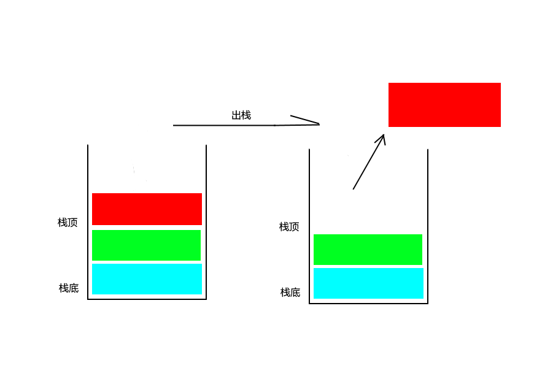

# 栈
## 栈的定义
栈，英文名称Stack，是一种允许在一端插入、删除的线性表，其中把允许插入和删除的一端叫做栈顶(top),另一端称作栈底(bottom)。在这里首先要明白栈是一种线性表，可以将其理解为操作受限的线性表(但其实有时候需要这样的线性表)，也具有前驱和后继的关系。栈中的元素就像弹夹装弹一样，最先打出来的第一发子弹，肯定是你最后装进弹夹的，这就是“后进先出”。而“装弹”的过程被称为入栈(push)，而“打枪”的过程被称为出栈(Pop)。
在这里具体解释下入栈，出栈：
+ 入栈：即在栈顶插入一个元素，也称为压栈、进栈，和子弹装入弹夹的过程很像。
+ 出栈：即删除栈顶的元素，也称为弹栈，就像子弹从弹夹中取出的过程。
下面的是入栈的过程：

下面的是出栈的过程：

## 栈的抽象化数据结构
栈的操作和线性表特别像（栈本来就是一种特殊的线性表），只是栈有一些特殊性，它的主要操作就是在栈顶插入和删除，而它的名称一般被称为Push(插入)和Pop(删除)。
一般来说栈有如下的操作：
1. InitStack(&S):初始化操作，建立一个空的栈。
1. ClearStack(&S):将栈清空。
1. StackEmpty(S):判断栈是否为空。
1. GetTop(S, &e):如果栈非空，用e返回栈顶元素，这里用e返回，是因为栈顶可能为空，因此用函数的返回值来返回栈的状态。
1. Push(&S, e):若栈存在，则将e放入栈顶。
1. Pop(&S, &e):入栈不为空，用e返回栈顶元素，并删除栈顶元素。
1. StackLength(S):返回栈顶元素的个数。
## 栈的顺序存储结构
之前说过栈是一种特殊的线性表，所以栈的存储结构也有两种，顺序存储和链式存储，这里首先来介绍顺序存储。
顺序存储，即使用数组来存储，设置一个数组和一个指向栈顶的top变量，当然栈底一般为0，这样可以多存储一些，一般的操作对于top进行。它的顺序存储的类型如下：
```c
#define MAXSIZE 100     // 这里可以根据实际需要来指定
typedef int dataType;   // 根据实际需要定义类型
typedef struct {
    datatype data[MAXSIZE];
    int top;
} SeqStack;
```
初始化一个栈就是将top置为-1。置为-1说明栈中没有元素。
```
void InitStack(SeqStack * S) {
    S->top = -1;
}
```
当然初始化这一个步骤很简单，也可以代码中完成。

入栈，将新元素添加入栈顶：
```c
// 返回0表示失败，返回1表示成功
int Push(SeqStack * S, dataType e) {
    if (S->top > MAXSIZE - 1) {
        printf("栈已经满了！\n");
        return 0;
    }
    S->top++;       // 将栈顶元素加1
    S->data[S->top] = e;
    return 1;
}
```
出栈，将栈顶元素放入e，然后删除：
```c
int Pop(SeqStack * S, dataType * e) {
    if (S->top == -1) {
        printf("栈为空！\n");
        return 0;
    }
    *e = S->data[S->top];   // 将栈顶元素放入e
    S->top--;               // "删除"栈顶元素
}
```
取栈顶，返回栈顶元素：
```c
// 当栈为空时，按照情况返回某个值表示，在Java或者其它语言中一般会抛出一个异常。
dataType GetTop(SeqStack S) {
    if (S.top == -1) {
        printf("栈为空！\n");
        return -1;
    }
    return S.data[S.top];
}
```
判断栈是否为空，也是栈的常用的操作：
```c
// 栈为空，返回1，否则返回0
int StackEmpty(SeqStack S) {
    if (S.top == -1)    // 因为栈为空时top = -1
        return 1;
    else
        return 0;
}
```
清空栈中元素：
```c
void ClearStack(SeqStack * S) {
    if (S->top != -1)
        S->top = -1;    // 如果栈不为空，则将其制空
}
```
## 栈的链式存储
栈的链式存储结构，简称链栈。
栈的顺序存储的最大确定是空间的使用，有时候申请太多会浪费，但有时太少又不够。
栈的基本操作时插入和删除，即出栈和入栈。一个链表有头和尾两头，那么插入和删除在头和尾那个进行好呢？当然是放在头部进行比较好，因为插入和删除都在链表的头指针之或者头结点之后，不需要从头遍历到尾。
下面的这个是栈的链式存储的定义：
```c
typedef int dataType;   // 按需求定义
typedef struct Node {
    dataType data;
    struct Node * next;
}* LinkStack, *PtrToNode;
```
下面的是栈的链式存储的一些函数：
```c
LinkStack CreateStack();    // 创建一个空栈
int Push(dataType X, LinkStack S);  // 入栈
void Pop(LinkStack S);              // 入栈 
dataType GetTop(LinkStack S);      // 取栈顶
int IsEmpty(LinkStack S);           // 判断栈是否为空
void MakeEmpty(LinkStack S);        // 置空栈
```
创建一个空栈，在这里栈使用的链表是带有头结点的。
```c
LinkStack CreateStack() {
    LinkStack S;
    S = (LinkStack) malloc(sizeof(struct Node));
    if (S == NULL) {
        printf("空间分配失败！\n");
        return NULL;
    }
    S->next = NULL;
    MakeEmpty(S);   // 这是一个将栈制空的操作，保证创建的栈是空的
    return S;
}
```
上面中的制空栈的函数，会在后面说到。
入栈，将新节点插入头结点之后。
```c
int Push(dataType X, LinkStack S) {
    PtrToNode temp;
    temp = (PtrToNode) malloc(sizeof(struct Node));
    if (temp == NULL) {
        printf("空间分配失败！\n");
        return 0;
    } else {
        temp->data = X;
        temp->next = S->next;
        S->next = temp;
    }
    return 1;
}
```
出栈，删除头结点之后的节点。
```c
void Pop(LinkStack S) {
    PtrToNode p;
    if (IsEmpty(S)) {
        printf("空栈！！\n");
    } else {
        p = S->next;
        S->next = S->next->next;
        free(p);
    }
}
```
取栈顶。
```c
dataType GetTop(LinkStack S) {
    if (!IsEmpty(S)) {
        return S->next->data;
    }
    printf("空栈！\n");
    return 0;
}
```
判栈空。
```c
int IsEmpty(LinkStack S) {
    if (S->next == NULL)
        return 1;
    else
        return 0;
}
```
置空栈。
```c
void MakeEmpty(LinkStack S) {
    if (S == NULL) 
        printf("必须先创建一个，然后才能制空栈");
    else
        while (!IsEmpty(S))
            Pop(S);
}
```