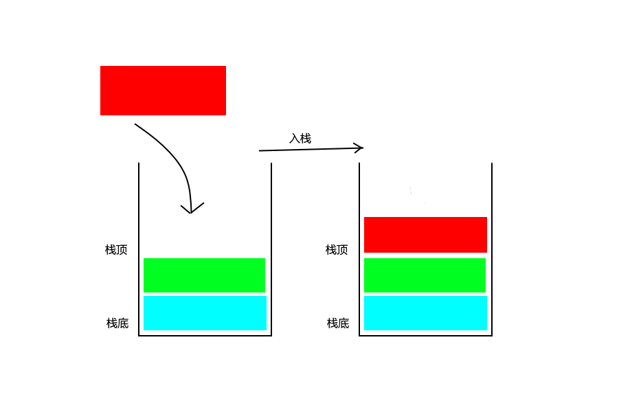

# 栈
## 栈的定义
栈，英文名称Stack，是一种允许在一端插入、删除的线性表，其中把允许插入和删除的一端叫做栈顶(top),另一端称作栈底(bottom)。在这里首先要明白栈是一种线性表，可以将其理解为操作受限的线性表(但其实有时候需要这样的线性表)，也具有前驱和后继的关系。栈中的元素就像弹夹装弹一样，最先打出来的第一发子弹，肯定是你最后装进弹夹的，这就是“后进先出”。而“装弹”的过程被称为入栈(push)，而“打枪”的过程被称为出栈(Pop)。
在这里具体解释下入栈，出栈：
+ 入栈：即在栈顶插入一个元素，也称为压栈、进栈，和子弹装入弹夹的过程很像。
+ 出栈：即删除栈顶的元素，也称为弹栈，就像子弹从弹夹中取出的过程。
下面的是入栈的过程：

下面的是出栈的过程：

## 栈的抽象化数据结构
栈的操作和线性表特别像（栈本来就是一种特殊的线性表），只是栈有一些特殊性，它的主要操作就是在栈顶插入和删除，而它的名称一般被称为Push(插入)和Pop(删除)。
一般来说栈有如下的操作：
1. InitStack(&S):初始化操作，建立一个空的栈。
1. DestoryStack(&S):删除一个栈。
1. ClearStack(&S):将栈清空。
1. StackEmpty(S):判断栈是否为空。
1. GetTop(S, &e):如果栈非空，用e返回栈顶元素，这里用e返回，是因为栈顶可能为空，因此用函数的返回值来返回栈的状态。
1. Push(&S, e):若栈存在，则将e放入栈顶。
1. Pop(&S, &e):入栈不为空，用e返回栈顶元素，并删除栈顶元素。
1. StackLength(S):返回栈顶元素的个数。
## 栈的顺序存储结构
之前说过栈是一种特殊的线性表，所以栈的存储结构也有两种，顺序存储和链式存储，这里首先来介绍顺序存储。
顺序存储，即使用数组来存储，设置一个数组和一个指向栈顶的top变量，当然栈底一般为0，这样可以多存储一些，一般的操作对于top进行。它的顺序存储的类型如下：
```c
#define MAXSIZE 100     // 这里可以根据实际需要来指定
typedef int dataType;   // 根据实际需要定义类型
typedef struct {
    datatype data[MAXSIZE];
    int top;
} SeqStack;
```
初始化一个栈就是将top置为-1。置为-1说明栈中没有元素。
```
void InitStack(SeqStack * S) {
    S->top = -1;
}
```
当然初始化这一个步骤很简单，也可以代码中完成。