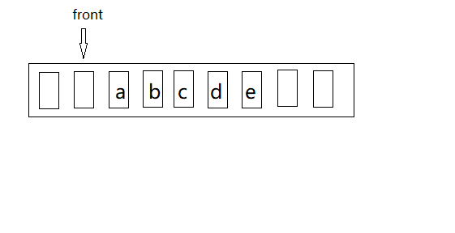
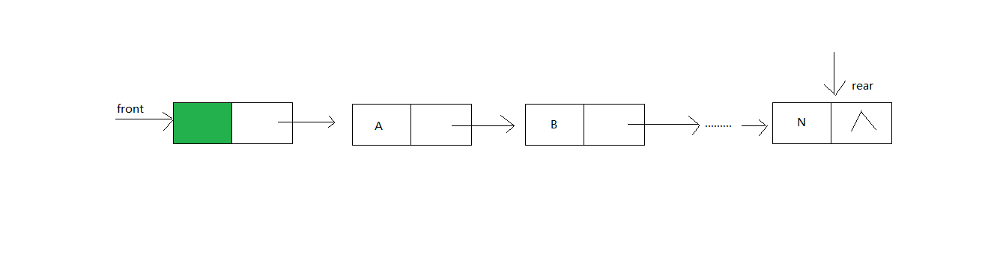

# 数据结构之队列

[toc]

队列，顾名思义就像一个队列。但是队列有什么特点呢？我们在学校基本上每天都在排队，但是然说它的特点，却是有些哑口无言。其实这队列的特点说出来跟没说一样，就是“先到先得”，例如排队买饭，肯定是先来的先买到，后来的排在最后。而队列的这种数据结构也是如此。而且队列在计算机中也是很有用的，比如打印机，打印机有一个打印的队列，先放进打印队列的肯定先打印，在比如输入输出缓冲区。
所以呢,队列是一种先进先出的数据结构（先进入队列的先出来，即FIFO,first in first out）
那么队列又是怎让实现“排队”的呢？
队列和栈一样也是一个顺序表，和栈一样这个顺序表也比较特殊，它的一端插入，另一端元素只能被删除。插入的那一端叫做队尾（rear）,而删除的那一端称作队头（front）。

既然是线性表，那么肯定有两种实现，数组实现和链表实现。
## 队列的数组实现
栈的数组实现是使用了一个top变量，而队列的数组实现使用的是两个变量，一个是front，一个是rear，一个用来记录队头，一个用来记录队尾。
```c
#define MAX_SIZE 100
typedef struct {
    int array[MAX_SIZE];
    int front;
    int rear;
} Queue;
```
在出队时，如果队列不为空，那么指向队头的变量加一就可以“删除”队头元素。而且判断队列为空也特别的简单,只需要判断指向队头的变量front不等于指向队尾的变量rear即可。而入队时也很简单，首先通过rear与这个数组的MAX_SIZE（数组申请的最大的空间）做比较，如果rear小于MAX_SIZE，那么该队列就没满，然后将元素插入，rear后移一位。
是不是觉得上述的过程非常简单，如果觉得队列的数组实现可以这样干，那么你就大错特错。想想front之前的空间还能用吗？上述的过程中可是没有说过front可以减，那么这么不仅会导致空间的浪费，还会导致这个队列能存储的元素越来越少。

那怎样才能让front之前的那些空间得到利用呢？小时候都玩过贪吃蛇，有一种，它可以穿墙，也就是从一边墙进，从另一边的墙出。那么队列也可不可以这样呢？当然可以的了，当它的指向队尾的变量rear与MAX_SIZE - 1相等时，若前面有没有被利用的空间，就让rear = 0，这样这个队列就像一个圆一样，这样的队列被称为循环队列。
### 循环队列

那么有一个问题就是如何使得当rear = MAX_SIZE - 1时让rear = 0？这里可以使用一个求模运算。
```
rear = (rear + 1) % MAX_SIZE;
front = (front + 1) % MAX_SIZE;
```
但是如何判断队列为空和队列为满呢？
一般来说队列中指向队头的front指向的时队头的前一个元素，
也就是这样：

这样就很容易的判断队列的空和满：

当front = rear时队列为空，当front+1 = rear时队列为满。
它的实现如下：
```c
#include <stdio.h>
#define FALSE 0
#define TRUE 1
#define MAX_SIZE 100
typedef char ElementType; 
typedef struct {
    ElementType array[MAX_SIZE];
    int front;
    int rear;
} Queue;

// 初始化队列，也就是将队列制空
int initQueue(Queue * q) {
    q->front = q->rear = MAX_SIZE - 1;
}
// 入队
int InQueue(Queue * q, ElementType element) {
    if ((q->rear + 1) % MAX_SIZE == q->front) {
        printf("队列已经满了！！");
        return FALSE;
    } else {
        q->rear = (q->rear + 1) % MAX_SIZE;
        q->array[q->rear] = element;
        return TRUE;
    }
}

// 出队
int OutQueue(Queue * q, ElementType * element) {
    if (q->front == q->rear) {
        printf("队列为空！！");
        return FALSE;
    } else {
        q->front = (q->front + 1) % MAX_SIZE;
        *element = q->array[q->front];
        return TRUE;
    }
}
// 判断队空
int EmptyQueue(Queue q) {
    if (q.front == q.rear) 
        return TRUE;
    else
        return FALSE;
}
```
这样做虽然完成了循环队列的出队和入队，但是却浪费了一个空间。那么有没有那种办法可以不浪费这一个空间吗？
有，当然有，一下时集中解决办法：
1. 利用一个count变量记录队列的长度。
2. 利用一个tag变量记录上一次时出队还是入队，如果当上次时**入队**，并且front = rear时，那么队列为满，当上次时**出队**，并且front = rear时队列为空。
### 队列的链式实现
在实际使用时有时候循环队列是不能满足我们的需求的，因为要使用循环队列则必须为循环队列中的数组分配一个空间，但是绝大多数情况是我们不知道我们到底需要多少的空间，分配多了浪费，分配少了又会溢出，总之他的缺点和数组的缺点是一样的。
说了循环队列的缺点，下面该说链队列的实现了。首先，想循环队列那样，链队列也“有头有尾”，“头”删除，尾插入。
下面的是链队列的定义：
```c
typedef int ElementType;
typedef struct node {
    ElementType element;
    struct node * next;
} QNode;
typedef struct {
    QNode * front;
    QNode * rear;
} LinkedQueue;

```
下面的是链队列的示意图：

下面的是链队列的实现：
```c
#include <stdio.h>
#include <stdlib.h>
typedef int ElementType;
typedef struct node {
    ElementType element;
    struct node * next;
} QNode;
typedef struct {
    QNode * front;
    QNode * rear;
} LinkedQueue;

// 创建一个带头结点空队列
LinkedQueue * initQueue() {
    LinkedQueue *q;
    QNode * p;
    q = (LinkedQueue *) malloc(sizeof(LinkedQueue));    // 申请一个链队列的指针
    p = (QNode *) malloc(sizeof(QNode));    // 申请链队列的头指针
    p->next = NULL;
    q->front = q->rear = p;     // 让头尾都指向头结点
    return q;
}

// 入队
void inLinkedQueue(LinkedQueue * q, ElementType x) {
    QNode * p;      // 申请一个新的节点
    p = (QNode *) malloc(sizeof(QNode));
    p->element = x;
    p->next = NULL;
    q->rear->next = p;
    q->rear = p;
}
// 判断对空
int isEmpty(LinkedQueue * q) {
    if (q->front == q->rear)
        return 1;
    else
        return 0;
}
// 出队
int outLinkedQueue(LinkedQueue * q, ElementType * x) {
    QNode * p;
    if (isEmpty(q)) {
        printf("队列为空");
        return 0;
    } else {
        p = q->front->next;
        q->front->next = p->next;
        *x = p->element;
        free(p);
        // 当队列中只有一个元素时，修改队尾指针
        if (q->front->next == NULL)
            q->rear = q->front;
        return 1;
    }
}
```